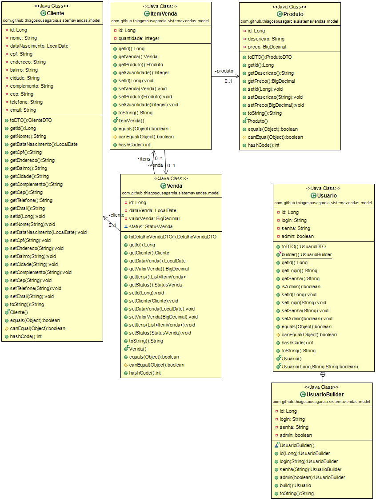
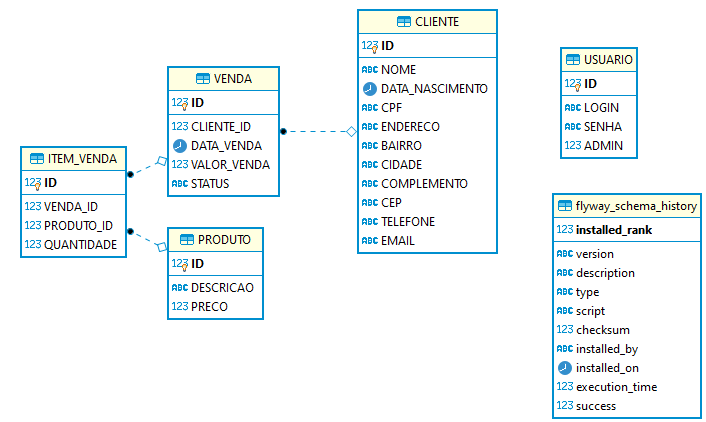

# Sistema de Vendas (Nome a definir) 
Versão 1.0

## Descrição
Projeto de um sistemas de vendas simples com aplicação de vários conceitos do ecossistema Spring.

## Principais tecnologias e frameworks utilizados 

### Spring Boot
o [Spring](https://spring.io/why-spring) torna a programação em Java mais rápida, fácil e segura para todos. O foco do Spring em velocidade, simplicidade e produtividade o tornou o framework Java mais popular do mundo.

### Spring Data 

A missão do [Spring Data](https://spring.io/projects/spring-data) é fornecer um modelo de programação baseado em Spring familiar e consistente para acesso a dados, enquanto ainda retém as características especiais do armazenamento de dados subjacente.

### Maven 

[Apache Maven](https://maven.apache.org/) é uma ferramenta de gerenciamento e compreensão de projetos de software. Com base no conceito de modelo de objeto de projeto (POM), o Maven pode gerenciar a construção, o relatório e a documentação de um projeto a partir de uma informação central.

### Flyway

[Flyway](https://flywaydb.org/documentation/) é uma ferramenta de migração de banco de dados de código aberto. Favorece fortemente a simplicidade e a convenção sobre a configuração.

### Lombok

[Lombok](https://projectlombok.org) é uma biblioteca java que se conecta automaticamente ao seu editor e ferramentas de construção, aprimorando o seu java. Automatiza suas variáveis de registro e muito mais.

### Pré-requisitos 

* Maven

* Java 8

* Docker Engine

* Microsoft SQL Server 17

* Base de dados **sistemaVendasDB** criada.

### Para executar
* Execute o Microsoft SQL Server com o seguinte comando:

~~~
docker run -d --name sqlserver2017 --restart=always -e "ACCEPT_EULA=Y" -e "SA_PASSWORD=DaTaBaSe6-3-3#TSG" -p 1433:1433 mcr.microsoft.com/mssql/server:2017-latest
~~~

* Execute o projeto com o seguinte comando:

~~~
mvn package spring-boot:run
~~~

### Documentação dos Endpoints
http://localhost:8095/sistema-vendas/swagger-ui.html

### Diagrama de Classes ###

### Modelo Entidade Relacional

### Referências
* Spring: https://spring.io/why-spring
* Spring Data: https://spring.io/projects/spring-data
* Maven: https://maven.apache.org/
* Lombok: https://projectlombok.org
* Flyway: https://flywaydb.org/documentation/

